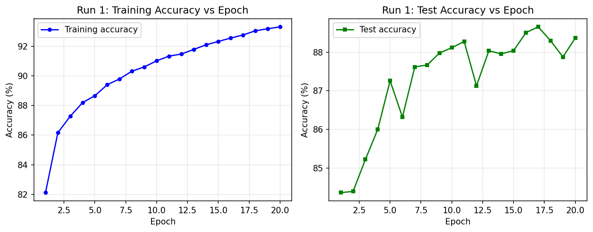
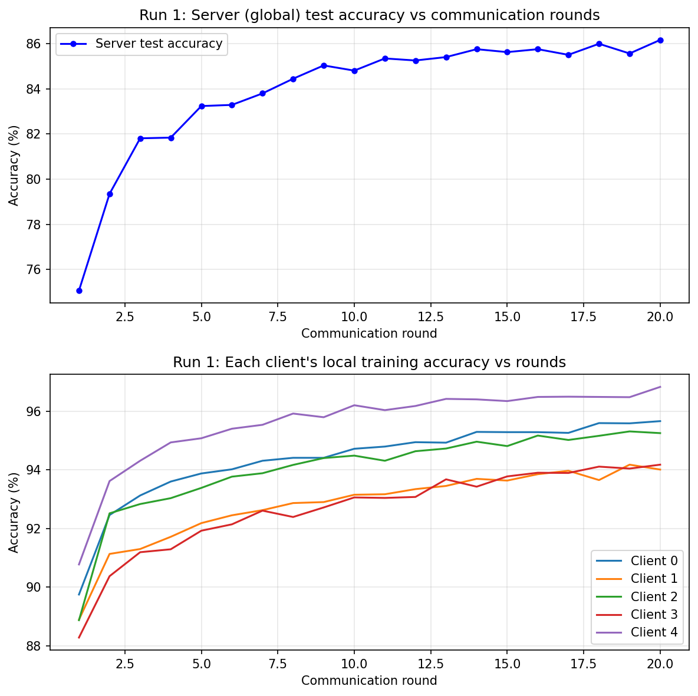
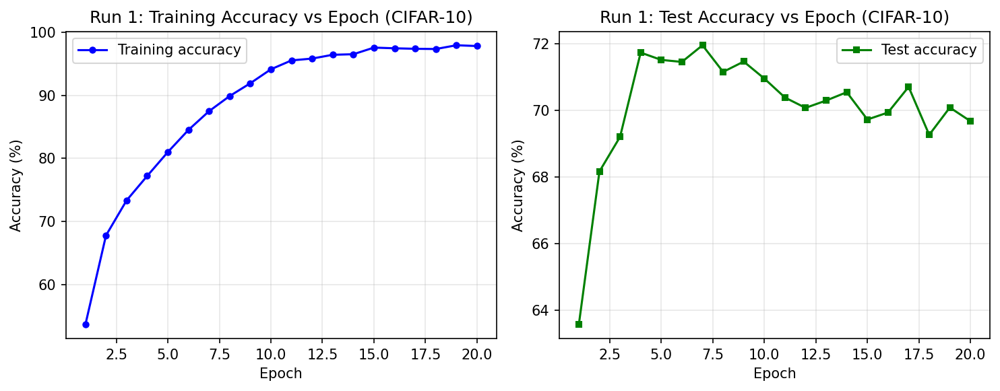
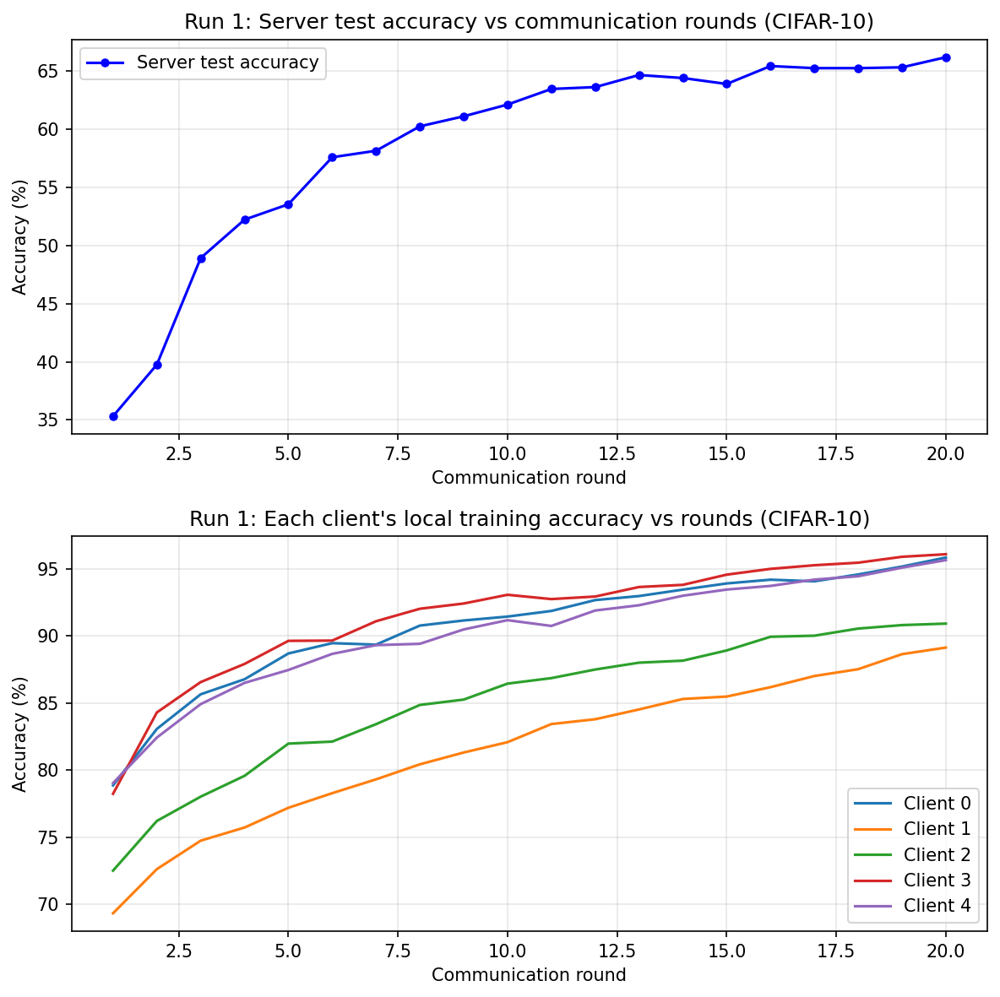

# Federated Learning Framework

A PyTorch project comparing **centralized** and **federated (FedAvg)** image classification on FashionMNIST and CIFAR-10. Each experiment runs multiple independent trials and reports mean and variance of final test accuracy, with accuracy plots saved automatically.

**Author:** Maneesha Prasanna  
**Repository:** [Federated-Learning-Framework](https://github.com/maneesha58/Federated-Learning-Framework)

---

## Overview

This project implements a simulated federated learning setup with 5 clients and a central server. Training data is split in a **non-IID** way so each client holds a majority of samples from two class labels. Results are compared against centralized baselines trained on the full dataset.

| Script | Dataset | Approach | Model |
|--------|---------|----------|-------|
| `centralized_baseline.py` | FashionMNIST | Centralized | 2-layer MLP |
| `fedavg_fashionmnist.py` | FashionMNIST | FedAvg (5 clients) | 2-layer MLP |
| `centralized_cifar10.py` | CIFAR-10 | Centralized | Small CNN |
| `fedavg_cifar10.py` | CIFAR-10 | FedAvg (5 clients) | Small CNN |

---

## Project Structure

```
ManeeshaPrasanna_DS_Project/
├── README.md
├── FedAvg_Report_ManeeshaPrasanna.pdf   # Full project report
├── images/                              # Accuracy plots (5 runs × 4 experiments)
│   ├── run_1_accuracy.png … run_5_accuracy.png
│   ├── fedavg_run_1.png … fedavg_run_5.png
│   ├── centralized_cifar10_run_1.png … run_5.png
│   └── fedavg_cifar10_run_1.png … run_5.png
└── srcCode/
    ├── centralized_baseline.py      # Centralized FashionMNIST baseline
    ├── fedavg_fashionmnist.py       # FedAvg on FashionMNIST
    ├── centralized_cifar10.py       # Centralized CIFAR-10 baseline
    └── fedavg_cifar10.py            # FedAvg on CIFAR-10
```

Datasets are downloaded automatically to `./data` on first run. Accuracy plots are saved when each script finishes (see `images/` for completed run outputs).

---

## Requirements

- Python 3.8+
- PyTorch
- Torchvision
- NumPy
- Matplotlib

Install dependencies:

```bash
pip install torch torchvision numpy matplotlib
```

GPU is used automatically when available; all scripts also run on CPU.

---

## Usage

Run scripts from the `srcCode` directory so dataset and plot paths resolve correctly:

```bash
cd srcCode
```

### Centralized baselines

```bash
python centralized_baseline.py
python centralized_cifar10.py
```

Each script trains for **20 epochs** over **5 independent runs** and prints per-run and aggregate test accuracy.

### Federated learning (FedAvg)

```bash
python fedavg_fashionmnist.py
python fedavg_cifar10.py
```

Each script simulates **20 communication rounds** over **5 independent runs**. In every round:

1. The server sends the global model to all clients.
2. Each client trains locally for one epoch on its non-IID data.
3. The server aggregates client weights with a **sample-size weighted average** (FedAvg).
4. The server evaluates the global model on the full test set.

---

## Models

### FashionMNIST (28×28 grayscale)

- **Architecture:** Flatten → Linear(784, 128) → ReLU → Linear(128, 10)
- **Optimizer:** Adam (lr = 0.001)
- **Loss:** CrossEntropyLoss

### CIFAR-10 (32×32 RGB)

- **Architecture:**
  - Conv2d(3→32, 3×3) → ReLU → MaxPool(2)
  - Conv2d(32→64, 3×3) → ReLU → MaxPool(2)
  - Flatten → Linear(4096, 128) → ReLU → Linear(128, 10)
- **Optimizer:** Adam (lr = 0.001)
- **Loss:** CrossEntropyLoss

---

## Non-IID Data Split

Training data is partitioned across 5 clients without overlap:

- Each label is assigned a **primary client** (labels 0–1 → client 0, 2–3 → client 1, etc.).
- A configurable fraction of each label’s samples goes to its primary client; the remainder is distributed round-robin to the other clients.
- **FashionMNIST:** `PRIMARY_FRACTION = 0.85`
- **CIFAR-10:** `PRIMARY_FRACTION = 0.95` (stronger skew to highlight the centralized vs. federated gap)

---

## Configuration

Common settings (editable at the top of each script):

| Parameter | Default | Description |
|-----------|---------|-------------|
| `BATCH_SIZE` | 64 | Mini-batch size |
| `NUM_EPOCHS` / `NUM_ROUNDS` | 20 | Training epochs (centralized) or communication rounds (FedAvg) |
| `NUM_RUNS` | 5 | Number of independent experiment runs |
| `NUM_CLIENTS` | 5 | Federated clients (FedAvg scripts only) |
| `LEARNING_RATE` | 0.001 | Adam learning rate |
| `RANDOM_SEED` | 42 | Reproducibility seed |

---

## Results

Full analysis is in [`FedAvg_Report_ManeeshaPrasanna.pdf`](FedAvg_Report_ManeeshaPrasanna.pdf). All accuracy curves for 5 independent runs are in [`images/`](images/).

### Summary (5 runs each)

| Setting | Avg Test Acc. | Variance | Gap vs. Centralized | Variance Reduction |
|---------|---------------|----------|---------------------|--------------------|
| Centralized FashionMNIST | **88.22%** | 0.0830 | — | — |
| FedAvg FashionMNIST | **86.23%** | 0.0051 | 1.99% | 16× lower |
| Centralized CIFAR-10 | **69.84%** | 0.1803 | — | — |
| FedAvg CIFAR-10 (0.95 skew) | **66.07%** | 0.0521 | 3.77% | 3.5× lower |

### Key findings

1. **FedAvg closes most of the centralized gap** — only 1.99% below centralized on FashionMNIST and 3.77% on CIFAR-10, despite non-IID partitions and no raw data sharing.
2. **FedAvg reduces run-to-run variance** — averaging across 5 clients each round acts as an implicit regularizer (16× lower variance on FashionMNIST, 3.5× on CIFAR-10).
3. **Stronger non-IID and harder tasks widen the gap** — CIFAR-10 uses `PRIMARY_FRACTION = 0.95` (vs. 0.85 on FashionMNIST), producing a larger federated penalty on the more complex dataset.
4. **Client drift is visible in plots** — local client training accuracy often exceeds global test accuracy, especially when clients specialize on their dominant classes.

### Sample accuracy curves (Run 1)

**Centralized FashionMNIST** — training and test accuracy over 20 epochs:



**FedAvg FashionMNIST** — global test accuracy (top) and per-client local training accuracy (bottom) over 20 rounds:



**Centralized CIFAR-10** — training and test accuracy over 20 epochs:



**FedAvg CIFAR-10** — global test accuracy (top) and per-client local training accuracy (bottom) over 20 rounds:



### Generated outputs

| Script | Plot files (also in `images/`) |
|--------|--------------------------------|
| `centralized_baseline.py` | `run_1_accuracy.png` … `run_5_accuracy.png` |
| `fedavg_fashionmnist.py` | `fedavg_run_1.png` … `fedavg_run_5.png` |
| `centralized_cifar10.py` | `centralized_cifar10_run_1.png` … `run_5.png` |
| `fedavg_cifar10.py` | `fedavg_cifar10_run_1.png` … `run_5.png` |

Each script also prints per-run final test accuracy, mean, and variance to the console after all 5 runs complete.

---

## FedAvg Algorithm

Weighted aggregation follows the standard FedAvg update:

```
global_weight = Σ (n_k / n_total) × client_weight_k
```

where `n_k` is the number of local samples on client `k` and `n_total` is the sum across all clients.

---

## License

This project was developed as part of a Data Science coursework assignment at Santa Clara University.
